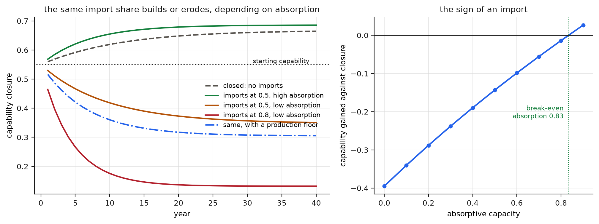

## Abstract

In June 2026 the sole maker of extreme ultraviolet lithography systems stated that it had never shipped one to China, and that none of the 314 machines operating worldwide is located there (Reuters, 2026a). On any measure of dependence built from trade flows, Chinese exposure to that machine is zero, because nothing is imported and therefore nothing can be cut off. The measure is inverted rather than merely imprecise, and the inversion is systematic. This paper separates import dependence from black-box dependence, defines the second, and builds three mechanisms that price the difference. A node is a strategic black box for a region when it is critical, when access to it can be interrupted by someone else, and when the region cannot credibly specify, verify, modify, produce, qualify, scale, service, or replace it at the required performance, quantity, cost, and horizon. The first mechanism gives 8 canonical node types generative ground truth, derives each one's true expected loss from an explicit shock and recovery process, and scores 3 competing indices against it: a capability index recovers the true ordering exactly at a rank correlation of 1.00, while import share and a concentration-weighted trade index correlate at −0.31 and −0.29, pointing the wrong way. Simulating an embargo on a single node drops its trade index from 0.94 to 0 while its true expected loss rises by a factor of 1.61. The second mechanism makes capability a stock, and finds the sign of an import conditional: at an import share of 0.5 the break-even absorptive capacity is 0.83, above which imports build capability and below which they erode it, with a production floor preventing the commons collapse that follows a fall below minimum efficient scale. The fall takes 14 years and the climb back to the starting level takes 20, and the level of a region that never lost the capability is unreachable behind a protective wall at all. The third mechanism builds 2 regions with identical mean burden of 0.237 and opposite topology, and their loss ranking reverses with the kind of shock, which is the formal case against any scalar dependence index. Selective unboxing is found to be lumpy: below a budget threshold, closing half of a set of chokepoints buys almost nothing, and in that underfunded window even blanket relocalization scores better, though the cited macroeconomic estimates place a cost on relocalization that the model does not charge it. The paper is an argument for measuring capability rather than for closing borders.

## The measure that reads zero

Begin with the case that breaks the instrument. Extreme ultraviolet lithography is made by one firm, whose 2025 annual report records approximately 5,100 suppliers and 48 such systems shipped in the year, against 279 deep ultraviolet systems, down from 374 the year before. The optics come from one supplier, exclusively: more than 40,000 parts in the High-NA projection optics weighing around twelve tons, more than 25,000 parts in the illumination system, a collaborating network of more than 1,200 members, and roughly a year to manufacture a single mirror (Carl Zeiss SMT, 2026). China imports none of these machines, having been forbidden to. In June 2026 the manufacturer stated it had never shipped one there, nor any component or module specially designed for one (Reuters, 2026a).

Now apply the standard instrument. The European Commission's External Vulnerability Index, built on 2022 trade data, scores external exposure from import shares, supplier concentration, and competitive position (Connell Garcia and Ho, 2025). Any measure of that family, applied to Chinese exposure to this machine, returns zero. There is no import to concentrate, no supplier to be exposed to, no flow to interrupt. The number is correct about the flow and silent about the thing anyone actually wants to know, which is whether an industry can proceed if a capability stays out of reach.

This is the signature of a measurement error with a direction, rather than a curiosity at the edge of an otherwise good index. Trade measures are built from what crosses a border, so they improve when a border closes. The quantity that governs consequences moves the other way.

## Two boundaries

The error has a precise location. Every production system has two boundaries that are commonly assumed to coincide. The production boundary asks where a thing is made. The knowledge boundary asks who could specify it, redesign it, verify that a substitute meets specification, manufacture it, qualify it for use, scale it, service it, and build its successor. Competent system integrators routinely hold a knowledge boundary wider than their production boundary; the classical statement is that firms know more than they make, and they do so deliberately, because integration requires understanding parts one has chosen not to build (Brusoni, Prencipe and Pavitt, 2001). The distinction has been tested against firm performance under technological change, where what a firm knows and what it makes have separable effects (Kapoor and Adner, 2012).

Crossing the two boundaries gives four cells. A closed capability is made here and understood here. A white-box import is made elsewhere and understood here, which is ordinary specialization and the condition of most trade. An enclave assembly is made here and understood elsewhere, so the output is domestic and the architecture, tooling, process recipes, firmware authority, and certification are not. Full black-box dependence is made elsewhere and understood nowhere in the region. Trade statistics observe one axis of this space. They cannot separate the white-box import, which is the healthy case, from the black box, which is the dangerous one, and they score the enclave as domestic production.

What travels across a supplier relationship depends on how codifiable the transaction is, how complex the specification, and how capable the supplier: this is the governance typology of global value chains, and it predicts which relationships transmit knowledge and which merely transmit parts (Gereffi, Humphrey and Sturgeon, 2005). Modular production networks were built precisely to make production separable from innovation, and they succeeded (Sturgeon, 2002). Some of what is separated is architectural knowledge, which is a distinct thing to lose, invisible in a component inventory and decisive when the architecture changes (Henderson and Clark, 1990). Some is tacit, carried in routines and practices rather than documents (Polanyi, 1966; Nelson and Winter, 1982). Holding a design without the complementary production and process assets is a known way to lose the returns on an innovation and eventually the innovation itself (Teece, 1986).

## The definition

A node is a strategic black box for a region at a horizon, a performance level, a production quantity, a cost ceiling, and a coalition boundary, when three conditions hold together: the node gates output that matters; continued access can be materially influenced by firms, states, licences, or routes outside the region; and the region or its coalition cannot credibly deliver qualified output at that performance, quantity, and cost within that horizon after the incumbent supply stops.

Every qualifier does work. The status is relational, since a node is a black box for someone. It is time-dependent, since capabilities and frontiers move. It is performance-dependent, since a working prototype falls short of a production tool. It is quantity-dependent, since making ten differs from making a million. It is coalition-dependent, since a member state, a union, and an alliance have different closure. And it is probabilistic, since neither capability nor access is ever known exactly, which means the honest output of an assessment is a distribution rather than a verdict. A claim that a region "can make" something, with no horizon, no volume, and no yield, is not yet a claim.

The condition also names what must be coded separately, and what practitioners most often merge: manufacturing location, corporate ownership, intellectual property, engineering knowledge, tooling access, software and update authority, certification authority, and control over allocation in a crisis. A foreign-owned plant on domestic soil is domestic in location and employment, and possibly foreign in every other column. The reverse also happens, and it is the better case.

## What the indices see

The paper's first mechanism turns the argument into arithmetic. Eight canonical node types are given generative ground truth that no index observes: how much output the node gates, the annual probability that qualified supply is interrupted, the probability the region can reconstitute it, whether an already-qualified alternative exists, and how long reconstitution takes. An explicit process then generates the quantity of interest, the expected discounted output loss over a 10-year horizon: interruptions arrive, an alternative is switched in quickly if one exists, the region rebuilds slowly if it can, and otherwise the loss runs to the end of the horizon. Three indices are then scored against that truth. Import share and a trade index formed from import share times supplier concentration see only flows. The capability index multiplies criticality, access risk, the complement of closure, the complement of substitutability, and reconstitution time normalized to the horizon.

Figure 1 reports the result. The capability index recovers the true ordering exactly, at a rank correlation of 1.00. Import share and the trade index score −0.31 and −0.286. The trade measures here are anti-correlated rather than merely noisy, because the archetypes that dominate the true loss are the ones whose flows are small. The embargoed frontier tool is first in true loss and last of 8 on the trade index. The ranking is exactly inverted. The enclave assembly, made locally under foreign design authority, sits third in true loss and seventh on trade. The ore a region knows how to process is sixth in true loss and third on trade, an overstatement in the other direction, which matters because acting on it wastes money that the real chokepoints need.

The embargo episode is the cleanest object in the mechanism, because it holds the node fixed and changes only its legal status. The same tool, supplied, carries a trade index of 0.94 and an expected loss of 3.97. Embargoed, its trade index falls to 0 and its expected loss rises to 6.39, a factor of 1.61. A dependence dashboard built on trade would record this as a large improvement in the week the exposure worsened.

The honest limit is reported with the same emphasis. Restricted to the four transparent nodes, the documented commodity, the white-box import, the understood ore, and the midstream material, the trade index reaches a rank correlation of 0.80. Where nothing is opaque, flows are a decent proxy for capability and the extra machinery earns little. The capability index is worth its cost in the opaque, controlled, and enclave cases, which are the cases that motivate the policy.

{width=100%}

## Six kinds of black box

The definition covers cases whose remedies differ, so the types must be kept apart. A **resource chokepoint** is missing physical access to an ore, a chemical, or an energy input, and its remedies are diversification, recycling, inventory, and substitution. A **process black box** is missing recipes, yield knowledge, and quality control, and it is repaired by pilot lines, production research, and people who have run the process. A **tooling black box** is missing the machines and instruments needed to make the thing, which is the recursive case, since tools are made by tools. An **architectural black box** is missing the ability to specify interfaces and integrate a system, and it is the hardest to notice, since every component may be available. A **software and control black box** is missing source, update authority, licences, or the cloud service a device calls home to, and it can be large while the goods trade behind it is small. A **scale and qualification black box** has a prototype and no yield. Volume, uptime, and certification are all missing.

Frontier lithography is all six except resource scarcity, in one machine, which is why it is the standing example and why the standing example is misleading if read as a story about a machine. Senior Chinese semiconductor executives said as much in March 2026, describing breakthroughs in light sources, wafer stages, and optical systems while integration into a working system remained unresolved, and naming design automation software, silicon wafers, and electronic gases as bottlenecks beside lithography (Reuters, 2026b). The controlled surface confirms the breadth from the other side: the December 2024 United States rules cover 24 categories of semiconductor manufacturing equipment and 3 categories of development software along with high-bandwidth memory (Bureau of Industry and Security, 2024). A policymaker's list of what to deny is an estimate of the dependency graph. It is much wider than one tool.

## How capability is lost

Capability is a stock, and stocks depreciate. The second mechanism writes the dynamic explicitly: closure grows with domestic production through learning by doing, with research, and with the knowledge a region absorbs from what it imports; it falls through depreciation and through the displacement of the domestic volume that sustained suppliers, tool shops, test rigs, and trained engineers. Absorption is the hinge, and the classical result is that using external knowledge requires prior related knowledge, so the capacity to absorb is itself a product of past investment (Cohen and Levinthal, 1990).

The model is therefore built so that imports can have either sign, and the interesting number is where the sign changes. Figure 2 reports it. At an import share of 0.5, the break-even absorptive capacity is 0.83: above it, importing half of consumption leaves a region more capable than closing the border entirely, and below it, the same import share erodes capability. A high-absorption importer at that share ends at 0.686 against an autarkic 0.665, so openness with absorption beats closure, which is the result that keeps this paper away from autarky. A passive importer at the same share ends at 0.351, and a deep importer at 0.8 with low absorption falls to 0.132.

The nonlinearity that turns erosion into collapse is a minimum efficient scale. Below it, suppliers exit, vocational programmes close, engineers move, qualification infrastructure disappears, and depreciation jumps, which is the industrial-commons mechanism (Pisano and Shih, 2012). The deep low-absorption arm crosses that threshold in its first year. A guaranteed production floor at 0.40 of demand, the modelled form of a procurement commitment, keeps the same region above the scale threshold and ends it at 0.306 rather than 0.132: the floor does not make the region a leader, and it keeps the commons alive.

Hysteresis follows. The fall from the starting level takes 14 years to complete. The climb back to that same starting level, behind a protected market and a serious public programme, takes 20, a factor of 1.43. And the level held by the region that never lost the capability while importing with high absorption is not reachable behind the wall at all, because the wall that funds the rebuild also excludes the knowledge that the open region was absorbing the entire time. This is the sharpest thing the mechanism says, and it cuts against the instinct the diagnosis usually provokes: a region that hollows out cannot buy its way back to where it would have been by closing.

The same machinery separates deployment from learning. Two regions install identical capacity from imports at a share of 0.85, one with high absorption and local engineering linkage, the other turnkey. The capability gap after 40 years is 0.41 on a scale whose maximum is 1. Installed gigawatts and installed capability are different accounts, and only one of them appears in the deployment statistics.

{width=100%}

## Breadth, depth, and why a scalar will not do

Regions do not differ only in how much dependence they carry. They differ in how it is arranged. The third mechanism builds two regions with an identical mean burden of 0.237 and opposite topology: one with 18 of 24 nodes above a moderate threshold, bound together through shared upstream clusters, and one nearly closed except for 4 frontier nodes at extreme burden. Under shocks that strike a shared upstream cluster, the broad region loses 0.72 against the deep region's 0.15. Under a shock that finds the single worst node, the deep region loses 0.86 against the broad region's 0.30. Same mean, opposite ranking. The kind of shock decides.

This is the formal case against any single dependence number, including the good ones. An index that averages calls these regions identical. A policy built on that average is wrong for both. What a region needs published is a distribution: how many nodes exceed a threshold, how bad the worst decile is, how concentrated the burden is, and how correlated the nodes are through shared upstream, since ten suppliers behind one cluster is one supplier wearing ten coats. The empirical literature on production networks says the same thing from the data side: specific inputs propagate, small nodes stop large outputs, and the aggregate consequences of microeconomic shocks depend on network structure rather than on size (Acemoglu, Carvalho, Ozdaglar and Tahbaz-Salehi, 2012; Barrot and Sauvagnat, 2016; Carvalho, Nirei, Saito and Tahbaz-Salehi, 2021).

The frontier adds the last complication. A region can accumulate capability continuously while the target moves. In the modelled race, capability rises by a factor of 4.59 over 30 years and the relative position improves from 0.41 to 0.52 of the frontier, while the absolute gap widens from 0.62 to 1.79. Both statements are true, and a public argument can be conducted entirely in one of them. Closing a generation is not the same accomplishment as closing a distance, and any assessment must report the closure rate against the frontier's movement rate rather than capability alone. This is the correct formal description of what a lithography programme faces: the reported start of mass production of domestically developed immersion deep ultraviolet tools, at roughly 5 machines in 2026 and about 20 in 2027 with some critical components still imported, is real movement on the capability curve while the frontier tool is a different machine entirely (Reuters, 2026c).

{width=100%}

## What to buy

Four instruments are then compared per unit of spend against a mixed shock ensemble, since a planner does not know which kind of shock will arrive. Diversification qualifies second sources, cheap per node and capped in effect, and it cannot help at a node whose burden is extreme partly because no alternative exists. Stockpiling is cheapest and buys months, so it does nothing against a node needing a decade. Selective unboxing rebuilds the capability at a node, expensive and nearly complete. Blanket relocalization spreads the same money across every node regardless of burden.

The results are topology-dependent, and one of them is uncomfortable. Under breadth, diversification wins at moderate budgets, avoiding 0.14 of loss against unboxing's 0.10 at the same spend, because 18 moderate nodes can each be given a second source for what 2 deep rebuilds would cost. Under depth, selective unboxing wins only above a budget threshold, and below it the picture inverts: closing 2 of 4 chokepoints leaves the adversary or the accident the other 2, so half a chokepoint buys nothing. In that underfunded window, blanket relocalization scores best of the four, for the reason that the alternatives are structurally unavailable there. That result stands with a stated qualification: the model charges all four instruments the same budget, while the modelled macroeconomic cost of relocalisation, over 18 percent of global trade and over 5 percent of global real output, with volatility rising in more than half of the economies examined, is a cost the other three do not carry (Organisation for Economic Co-operation and Development, 2025). Priced properly, the underfunded-depth window is an argument for funding the chokepoint properly rather than for relocalizing everything.

The unit of policy is therefore a minimum viable capability portfolio: architecture, metrology, repair, second-source qualification, pilot-scale production, surge plans, open interfaces, and enough learning by doing to keep the absorption term high. A region can be extremely open and hold all of it. Tariffs restore none of it. A tariff moves a price, and architectural knowledge, tacit process competence, and certification authority are not prices.

## Five positions

The framework's use is comparative, and the comparison is not one of national virtue. Europe holds nodes of extraordinary depth: the lithography integrator and its optics supplier are European capability commons of a kind that exist almost nowhere else. Its characteristic risk is breadth, a larger number of intermediate gaps across refined materials, midstream stages, components, tooling, platforms, and qualification chains, which the topology mechanism says is punished by correlated upstream shocks rather than by single chokepoints. The concentration is documented on the other side of the same stack: one country holds around 85 percent of solar and 80 percent of lithium-ion battery supply-chain capacity, 95 percent of photovoltaic wafers, and 97 percent of anode materials, processes over 70 percent of lithium, cobalt, graphite, and rare earths, and each of these chains contains at least one step where production outside the largest exporter covers less than a quarter of demand (International Energy Agency, 2026a). A month of interrupted battery-chain exports would cost about 17 billion United States dollars at electric-car plants elsewhere. Almost two-thirds of that falls in the European Union.

The discipline comes at once. Europe had capacity to make around 95 GW of inverters per year in 2025 against roughly 90 GW of demand, and switching utility-scale projects away from the dominant suppliers implies a project cost premium of just under 2 percent (International Energy Agency, 2026b). Import share and absent capability are different facts, and conflating them produces expensive policy aimed at the wrong node. The trade index makes the same point in the other direction: on 2022 data the European Union scores 0.22 on all industrial products against the United States at 0.28 and China at 0.13, and 0.22 on semiconductors against 0.19 and 0.17 (Connell Garcia and Ho, 2025). The European position is not uniquely exposed on the flow measure. The argument of this paper is that the flow measure is the wrong instrument, which is a different and more serious claim than the declinist one.

China's characteristic risk is depth. Its stated programme is explicitly a chain programme: the October 2025 Five-Year Plan recommendations call for decisive breakthroughs across entire chains in integrated circuits, machine tools, high-end equipment, basic software, advanced materials, and biomanufacturing (Central Committee of the Communist Party of China, 2025). Read through this framework it is a plan to reduce black-box depth, and its unit is correct. What it faces is the frontier race above, and a second case that shows depth is not confined to semiconductors: the C919 flies on an engine from a transatlantic joint venture (Safran, 2026), and in May 2025 a licence suspension turned that subsystem into a program-level risk within weeks, before being lifted in July. The dependency was invisible in ordinary statistics, became decisive by administrative decision, and reverted with the capability position unchanged, which is the definition working as written.

The United States occupies a third position, which the definition separates cleanly. Its share of global semiconductor manufacturing capacity fell from 37 percent in 1990 to 10 percent in 2022, and as of 2022 it produced no leading-edge logic at commercial scale and 3 percent of the two most common memory types (Government Accountability Office, 2025). At a far less glamorous level, grid equipment shows lead times of two or more years and transformer price increases of 4 to 9 times over 5 years for some categories (Department of Energy, 2025). This is reconstitution time rather than epistemic opacity: knowing how the box works and being unable to make enough boxes soon enough. It is a different failure with different remedies, and an index that scores only closure would miss it, which is why reconstitution time enters the burden as its own term.

Latin America and Africa enter this framework as capability ladders rather than as regional averages, and the ladder has four rungs: operating an installed system, maintaining it, reproducing it, and redesigning it. Enclave sophistication is the condition of standing on the first rung while the output statistics report the fourth, and the regional evidence describes persistent low growth, weak productivity, and premature deindustrialization alongside genuine upgrading opportunities (United Nations Industrial Development Organization, 2026). Pharmaceuticals show the ladder plainly: imports account for as much as 70 to 90 percent of medicines consumed in most of sub-Saharan Africa, and local production requires regulatory systems, analytical chemistry, validated process control, and technology transfer rather than plants (Dong and Mirza, 2016). The right question about an investment is which rung of that ladder it moves a region to, which is the deployment-versus-learning result of the second mechanism applied to development.

## Objections

The most serious objection is that capability scores are soft where trade data are hard. It is true. It is also why the definition is probabilistic and why the coding rules matter: score each dimension separately, record the evidence, use more than one assessor on contested nodes, report reliability, treat missing information as uncertainty rather than as zero, and keep announced capacity, laboratory prototype, and qualified serial production in different columns. A noisy measure of the right quantity can still dominate a precise measure of the wrong one, and the first mechanism is the demonstration: an index built from five coarse judgments recovers an ordering that flow data invert.

A second objection is that the mechanisms are stylized. They are. The archetypes are built rather than sampled, the shock process is simple, and the burden formula is multiplicative because a node is dangerous only when several conditions hold together. The claims are correspondingly about shape: which measure recovers an ordering, where the sign of an import changes, whether a ranking survives a change of shock, and whether an instrument's advantage depends on topology. Each of those survives parameter movement, every constant is published, and every invariant is a test the run must pass.

A third objection is that the framework licenses protectionism by giving industrial policy a vocabulary. The model answers with its own numbers: closure loses to open absorption, blanket relocalization is never the best instrument at any adequate budget, and the cited estimate of relocalisation's macroeconomic cost is stated where the paper's argument is strongest rather than buried. The claim is narrower. A region should know which of its nodes it could not reconstitute, and that knowledge is compatible with importing nearly everything.

A fourth objection is that access risk is political and therefore unforecastable. This is right, and it is why the term belongs in the index rather than in the disclaimer. Networks of interdependence become instruments of coercion for whoever sits at their chokepoints (Farrell and Newman, 2019), which means access probability is a function of alignment and of somebody else's decision, and should be reported as a scenario over coalitions rather than as a constant.

## Falsification

The framework is empirical and can lose. Here is how. It loses if, once import concentration and network centrality are included, capability variables add no predictive power for output loss and recovery time after real shocks. It loses if domestic manufacturing presence predicts fast reconstruction regardless of ownership, tooling, and architectural control, which would collapse the enclave cell. It loses if external procurement produces no measurable long-term capability decay, which would remove the displacement term and with it the commons cliff. It loses if regional production volume turns out to be unrelated to supplier survival, skills, and qualification infrastructure. It loses if capability scores prove too unreliable to reproduce across assessors, which is the one failure that would be fatal rather than corrective. And it loses if breadth and depth turn out not to distinguish real regions, so that the topology result has no referent outside the model.

The programme that would settle these is specifiable: an engineering ontology of nodes per stack rather than a trade-code list, capability coded per dimension with recorded evidence and inter-rater reliability, and validation against dated disruptions where output, price, lead time, and recovery are observable, asking whether pre-shock black-box burden predicts severity better than import concentration and foreign value added. This paper builds the framework and the mechanisms that show what such a study would be testing. That study remains to be run.

## What is worth measuring

The point of a measure is to be wrong in ways that matter less than the alternative. Import statistics are exact about a quantity that stops being informative at the moment a relationship becomes strategic, and their most dangerous property is that they improve at the moment of denial. The quantity worth publishing is the credible option to understand, verify, modify, reproduce, qualify, scale, service, and supersede a node within the time available, along with the shape of its distribution across a region's nodes.

The hardest black box is the ecosystem that produces, measures, services, and supersedes a product, which is why a country can hold every component of a machine and still not have the machine, and why one firm's 5,100 suppliers and another's year-long mirror are the real object of study rather than the tool they converge on. The corresponding policy question concerns which of the things a region buys it could still make, and how long it would take to find out.

## Reproducibility

The simulation, its 3 figures, and every model number quoted above regenerate from one command in the paper's repository (`simulation/run_all.py`; mechanisms 1 and 3 run on recorded seeds, mechanism 2 is deterministic, bit for bit). 37 invariants, among them the capability index beating both trade measures, the embargo simultaneously improving the trade index and worsening the truth, the trade index remaining adequate on the transparent subset, the conditional sign of imports and the interior break-even, the production floor preventing commons collapse, the rebuild taking longer than the decline while the never-lost level stays unreachable behind a wall, the ranking reversal between shock types, the frontier gap widening while the ratio improves, and the lumpiness of selective unboxing, fail the run loudly if broken. The verified external figures enter results.json as cited records with their sources.

## References

Acemoglu, D., Carvalho, V. M., Ozdaglar, A., and Tahbaz-Salehi, A. (2012). The network origins of aggregate fluctuations. *Econometrica*, 80(5), 1977--2016.

*ASML 2025 Annual Report* (2026). Veldhoven: ASML Holding N.V.

Barrot, J.-N., and Sauvagnat, J. (2016). Input specificity and the propagation of idiosyncratic shocks in production networks. *The Quarterly Journal of Economics*, 131(3), 1543--1592.

Brusoni, S., Prencipe, A., and Pavitt, K. (2001). Knowledge specialization, organizational coupling, and the boundaries of the firm: Why do firms know more than they make? *Administrative Science Quarterly*, 46(4), 597--621.

Bureau of Industry and Security (2024). *Commerce Strengthens Export Controls to Restrict China's Capability to Produce Advanced Semiconductors for Military Applications*. Washington: United States Department of Commerce, December 2, 2024.

Carvalho, V. M., Nirei, M., Saito, Y. U., and Tahbaz-Salehi, A. (2021). Supply chain disruptions: Evidence from the Great East Japan Earthquake. *The Quarterly Journal of Economics*, 136(2), 1255--1321.

Central Committee of the Communist Party of China (2025). *Recommendations for Formulating the 15th Five-Year Plan for National Economic and Social Development*. Beijing, October 2025.

Cohen, W. M., and Levinthal, D. A. (1990). Absorptive capacity: A new perspective on learning and innovation. *Administrative Science Quarterly*, 35(1), 128--152.

Connell Garcia, W., and Ho, V. (2025). External vulnerability index: A tool to assess trade weaknesses. *Intereconomics*, 60(1). European Commission, Single Market Economics Briefs.

Department of Energy (2025). *Strengthening America's Grid Supply Chain*. Washington: Office of Electricity, United States Department of Energy.

Dong, J., and Mirza, Z. (2016). Supporting the production of pharmaceuticals in Africa. *Bulletin of the World Health Organization*, 94(1), 71--72.

Farrell, H., and Newman, A. L. (2019). Weaponized interdependence: How global economic networks shape state coercion. *International Security*, 44(1), 42--79.

Gereffi, G., Humphrey, J., and Sturgeon, T. (2005). The governance of global value chains. *Review of International Political Economy*, 12(1), 78--104.

Government Accountability Office (2025). *Semiconductors: Information on Projects Funded to Strengthen U.S. Supply Chain*. GAO-26-107882. Washington: United States Government Accountability Office.

Henderson, R. M., and Clark, K. B. (1990). Architectural innovation: The reconfiguration of existing product technologies and the failure of established firms. *Administrative Science Quarterly*, 35(1), 9--30.

International Energy Agency (2026a). *Supply Chain Risks and Industrial Competitiveness*. In *Energy Technology Perspectives 2026*. Paris: International Energy Agency.

International Energy Agency (2026b). *Inverter Supply Chains and Cybersecurity*. Paris: International Energy Agency.

Kapoor, R., and Adner, R. (2012). What firms make vs. what they know: How firms' production and knowledge boundaries affect competitive advantage in the face of technological change. *Organization Science*, 23(5), 1227--1248.

Nelson, R. R., and Winter, S. G. (1982). *An Evolutionary Theory of Economic Change*. Cambridge, MA: Harvard University Press.

Organisation for Economic Co-operation and Development (2025). *OECD Supply Chain Resilience Review: Navigating Risks*. Paris: OECD Publishing.

Pisano, G. P., and Shih, W. C. (2012). *Producing Prosperity: Why America Needs a Manufacturing Renaissance*. Boston: Harvard Business Review Press.

Polanyi, M. (1966). *The Tacit Dimension*. London: Routledge and Kegan Paul.

Reuters (2026a). ASML denies selling EUV chipmaking tool to China after report of US concern. June 19, 2026.

Reuters (2026b). China's top chip bosses urge supportive policies to create "China's ASML". March 5, 2026.

Reuters (2026c). China starts production of home-grown immersion DUV chipmaking tools, source says. July 28, 2026.

Safran (2026). *LEAP-1C: New Generation Engine for Single-Aisle Commercial Jets*. Paris: Safran Aircraft Engines.

Sturgeon, T. J. (2002). Modular production networks: A new American model of industrial organization. *Industrial and Corporate Change*, 11(3), 451--496.

Teece, D. J. (1986). Profiting from technological innovation: Implications for integration, collaboration, licensing and public policy. *Research Policy*, 15(6), 285--305.

United Nations Industrial Development Organization (2026). *Industrial Development Report 2026: Latin America and the Caribbean Regional Report*. Vienna: UNIDO.

Carl Zeiss SMT (2026). *High-NA EUV Lithography*. Oberkochen: Carl Zeiss SMT.
